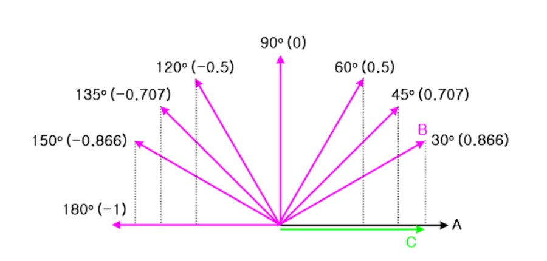

미분
-------------
미분이란 함수 내 한 점의 기울기를 뜻한다.  
본래 기울기란 함수 내 두 점을 이은 직선을 의미하는데 엄밀히 말하면 미분도 이 점을 충족하는 두 점의 기울기이다.  
다만 기울기를 구하려는 A라는 점에 한없이 가까운 B라는 점과의 사이를 이은 기울기라는 점이 차이점인데 이를 식으로 나타내면 아래와 같다.  

$$
  \lim_{xInc \rightarrow 0} \frac{yInc}{xInc} = \lim_{h \rightarrow 0} \frac{f(a+h)-f(a)}{(a+h)-a}
$$

함수 내의 점 (a, f(a))가 있을 때 이를 h만큼 이동시킨 점은 (a + h, f(a + h))가 된다.  
여기서 h를 0에 한없이 가까운 수라고 보았을 경우 두 점은 한없이 가까운 위치가 되며 사실상 한 점이 되어 한 점의 기울기를 나타낼 수 있는 것이다.  

$$
  \lim_{h \rightarrow 0} \frac{f(a+h)-f(a)}{(a+h)-a} = f`(a)
$$

그리하여 최종적으로 미분의 정의는 이렇게 된다.  

행렬
-----------------------
행렬이랑 array 혹은 matrix형태로 구성된 데이터의 집합이다.  
행렬에 대한 부분은 행과 열로 구분을 하며 각각 원소를 나타내고 있다.  
행렬에는 여러가지 종류가 있는데 이렇게 다양한 종류로 나누어 사용하는 이유는 단일화된 일반적인 행렬로만 처리를 하기 보다는 각자 상황에 맞게 최적화된 행렬을 사용하는 것이 효율이 좋고 오차를 줄일 수 있기 때문이다.  

|행렬종류|설명|
|-------|----|
|정방행렬|행과 열의 수가 같은 행렬|
|전치행렬|행과 열의 위치를 바꾼 행렬|
|대칭행렬|정방행렬이면서 대각선을 기준으로 위, 아래의 값이 동일한 행렬|
|교대행렬|정방행렬이며 대각선의 값은 0이고 위, 아래의 값은 부호만 서로 반대인 행렬|
|항등행렬|정방행렬이면서 대각선의 값은 1이고 나머지는 다 0인 행렬. 단위행렬이라고도 한다|
|삼각행렬|정방행렬이면서 대각선을 포함한 위쪽에만 값이 있는 행렬. 대각선을 포함해 아래쪽에만 있는 경우 하삼각행렬이라 한다|
|대각행렬|대각선에만 값이 있고 나머지는 모두 0인 행렬|
|직교행렬|회전과 관련된 처리를 할 때 사용하는 행렬|
|역행렬|행렬에 어떤 값을 곱하여 단위(항등)행렬이 되게 하는 행렬|
|정칙행렬|역행렬이 존재하는 행렬|
|멱등행렬|정방행렬이면서 행렬을 반복적으로 곱해도 자기 자신이 되는 행렬|
|양정치행렬|행렬을 방정식으로 표현했을 때 항상 양의 값을 취하는 행렬. 통계의 공분산행렬이라는 것과 연관|
|투영행렬|임의의 벡터를 어떤 공간에 투영시킬 때 정의되는 행렬. 통계의 최소자승법이라는 계산과 연관|

벡터
-------------------
우리가 일상적으로 사용하는 데이터를 스칼라라고 정의하면 이 스칼라는 크기만 존재한다.  
가령 1보다 2가 더 크다는 것을 쉽게 알 수 있고 이것이 우리가 일상생활에서 흔히 사용하는 스칼라의 개념이다.  
벡터는 여기에 방향을 더한 것으로 크기 + 방향으로 데이터를 정의한 것이다.  
벡터는 방향성을 가지게 되며 이를 스칼라와 마찬가지로 숫자로 표현한 것이며 위치는 상관없다.  

벡터의 연산
--------------------
일반적인 사칙연산처럼 벡터에도 사칙연산이 있다.  
벡터간의 계산에서 덧셈, 뺄셈을 쓰며 스칼라와 벡터의 계산에서 곱셈, 나눗셈을 사용한다.  

벡터간의 덧셈은 벡터a의 시작지점을 벡터b와의 시작지점과 일치하도록 이동시키거나 반대로 벡터b의 시작지점을 벡터a의 시작지점으로 이동시킨 후 각각의 벡터와 평행한 벡터a,b를 각각 다시 그려서 덧셈하는 평행사변형 방식을 사용한다.  
삼각형 방식으로 더할 경우에는 두 벡터의 시작지점을 일치시킨 후 삼각형의 빗변에 해당하는 벡터를 새로 그려서 덧셈을 한다.  

좌표벡터
---------------------
좌표상에서 벡터를 표현할 때는 좌표값을 이용해 벡터의 표현을 한다.  
가령 3차원 상에 존재하는 벡터를 좌표값으로 표시하면 (a1, a2, a3)로 나타내며 벡터의 크기는 $\vec{|a|} = \sqrt[]{a^2_1+a^2_2+a^2_3}$가 된다.  

벡터에서는 크기가 1인 벡터를 단위벡터라고 하는데 벡터a와 방향이 같고 크기가 1인 단위벡터를 구하는 식은 다음과 같다.  

$$
\frac{ 1 } { \sqrt[]{a^2_1+a^2_2+a^2_3} } (a_1, a_2, a_3)
$$

좌표벡터 (3, 4)에 대해 단위벡터를 구하는 식은 다음과 같다.  

$$
( \frac{3}{5}, \frac{4}{5})
$$

기본 단위벡터
--------------------
좌표공간상에서 각각의 좌표에 대해 기본 단위벡터는 해당 좌표값에만 값이 있고 나머지 좌표는 값이 0인것을 뜻한다.  

$$
( i \rightarrow (1, 0, 0), j \rightarrow (0, 1, 0), k \rightarrow (0, 0, 1))  
$$
$$
\vec{a} = (a_1, a_2, a_3) = a_1i + a_2j + a_3k = a_1(1,0,0) + a_2(0,1,0) + a_3(0,0,1)
$$

임의의 벡터가 크기가 1인 경우에 해당 벡터에 대한 좌표벡터를 각도로 표현하여 단위벡터를 나타낼 수 있다.  
각도로 표현한 단위벡터는 다음과 같다.  

$$
(\cos \theta , \sin \theta)
$$

벡터의 내적
------------------------
내적은 스칼라곱(scalar product) 또는 Dot Production이라고 하며 기호로 $\cdot$을 사용한다.  
벡터의 내적을 구하는 방법은 두 가지가 있는데 첫번째는 좌표값의 각 성분을 곱해서 더하는 것이다.  
A$\cdot$B(A와 B의 내적) $= (A_x * B_x) + (A_y * B_y)$  

두번째는 벡터의 크기를 곱하는 것이다.  
A$\cdot$B(A와 B의 내적) = $|B| * |A| * cos\theta$  

프로그래밍을 할 때는 보통 단위벡터를 사용하는데 두 단위벡터의 내적값을 이용하여 벡터의 사이각이나 뻗어있는 정도를 알 수 있기 때문이다.  
위의 식에 단위벡터를 대입하면 A와 B의 내적은 $cos\theta$가 된다.  

단위벡터 A에 대해 단위벡터 B의 각도를 바꿔가며 내적값을 구하면 위 이미지와 같다.  
이를 통해 내적값이 양수면 두 벡터의 사이각이 0 ~ 90 or 0 ~ -90도이고  
내적값이 음수면 90 ~ 180 or -90 ~ -180도이며  
내적값이 0이면 두 벡터는 수직임을 알 수 있다.  

코사인 유사도
--------------------------
코사인 유사도는 두 벡터의 방향이 어느정도로 일치하는지를 실수를 통해 보여주는 수치이다.  
두 벡터가 완전히 동일할 경우 값은 1이며 수직이면 0, 정반대일 경우 -1이다.  
코사인 유사도를 식으로 표현하면 다음과 같다.  

$$
similarity = cos(\theta) = \frac{A \cdot B}{||A|| ||B||} = \frac{\sum_{i=1}^nA_i*B_i}{\sqrt[]{\sum_{i=1}^n(A_i)^2} * \sqrt[]{\sum_{i=1}^n(B_i)^2}}
$$ 

