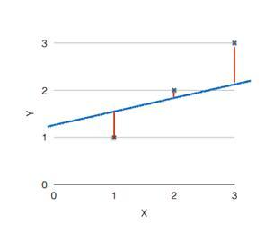
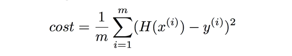
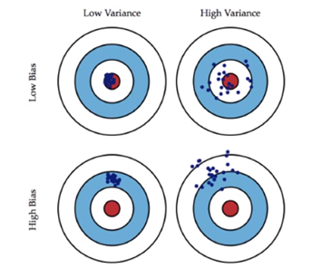
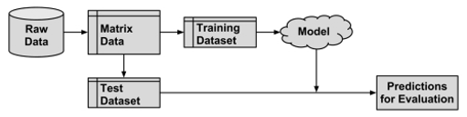
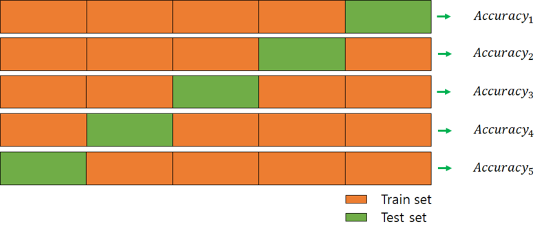

선형회귀(Linear Regression)
---------------------------------
* 사전적 의미  
선형회귀는 종속변수 y와 한 개 이상의 독립변수 x와의 선형 상관 관계를 모델링하는 회귀분석 기법  

* 선형회귀함수  
H(x) = Wx + b  

  

위 그래프를 보면 그래프(주어진 데이터가 어떤 함수로부터 생성된 것인지에 대한 가설)와 점(데이터) 사이가 가까울 수록 가설이 일치한다는 것을 의미한다.  
이 거리를 구하는 것을 Cost function, Loss function이라고 한다.  
Const function은 가설과 실제 데이터의 차의 제곱을 계산하는 것이며 위 이미지와 같이 그래프에 3개의 데이터를 비교한다면 다음과 같은 식이 된다.  

```
((H(x¹) - y¹)² + (H(x²) - y²)² + (H(x³) - y³)²) / 3
```

이 3개의 데이터를 모두 더한 후에 갯수 3만큼 나누어준다.  
하지만 데이터 갯수가 많아지면 이러한 수식으로는 해결하기가 어렵기 때문에 일반적으로는 다음과 같이 표현한다.  

  

여기서 m은 실제 데이터 갯수를 나타낸다.  


출처 : https://blog.martinwork.co.kr/ai/2018/07/10/what-is-linear-regression.html


로지스틱 회귀
----------------------------------
로지스틱 회귀는 선형회귀와 달리 x는 어떠한 값이든 올 수 있지만 y축은 0과 1(실패, 성공)의 두 가지 값만이 존재한다.  
때문에 이러한 구조의 데이터를 그래프로 표현하기 위해 시그모이드 함수를 사용한다.  

SVM
-----------------------------------
서포트 벡터 머신(Support Vector Machine)은 기계학습의 분야 중 하나로 패턴인식, 자료분석을 위한 지도학습모델이며 주로 분류와 회귀분석에 사용된다.  
두 카테고리 중 어느 한 쪽에 속한 데이터의 집합이 주어졌을 때 SVM 알고리즘은 주어진 데이터의 집합을 바탕으로 새로운 데이터가 어느 카테고리에 속할 지 판단하는 `비확률적 이진 선형 분류 모델`을 만든다.  
만들어진 분류 모델은 사상된 공간에서 경계로 표현되는데 SVM 알고리즘은 그 중 가장 큰 폭을 가진 경계를 찾는 알고리즘이다.  


랜덤 포레스트
------------------------------------
랜덤 포레스트는 분류, 회귀분석 등에 사용되는 앙상블 학습 방법의 일종으로 훈련과정에서 구성된 다수의 결정트리로부터 분류 및 평균 예측치(회귀분석)를 출력함으로써 동작한다.  

* 앙상블 학습 방법  
학습 알고리즘들을 따로 쓰는 경우에 비해 더 좋은 예측치를 얻기 위해 다수의 학습 알고리즘을 사용하는 방법.  

* 결정 트리  
트리는 계층구조로 이루어진 노드와 에지들의 집합으로 이루어져있다. 또한 노드는 내부노드, 종단노드로 나뉘어진다.  
그래프에서와 달리 트리에서는 모든 노드가 들어오는 에지를 하나만 가지는 반면 각 내부 노드에서 나가는 에지는 개수에 제한이 없으나 주로 2개의 나가는 에지를 가지는 것으로 정의한다.  
결정트리는 말 그대로 결정을 내리기 위해 사용하는 트리로 결정과정을 간단한 문제들로 이루어진 계층구조로 나눈다.  


MLP
--------------------------------------
단일 선형 변환(Single linear transformation)을 통해 입력과 출력 레이어를 매핑할 경우 간단한 선형함수로 서로간의 관계를 연관지을 수 있다면 적절한 방법이라고 볼 수 있다. 하지만 이는 너무 강한 가정으로 입력값이 증가하면 다른 입력값과는 상관없이 출력값이 변화하는 결과를 가져온다.  

가령 흰색, 검은색과 개, 고양이를 매핑한다면 이는 흰색은 개, 검은색은 고양이 혹은 그 정반대의 결과만이 존재하며 이는 올바른 매핑이라 보기 어렵다. 개와 고양이를 판별하기 위해서는 각각의 많은 특성들을 관계지어서 이를 통한 가능성을 고려해야하며 선형모델은 이러한 경우에 정확도가 낮다.  
때문에 입력과 출력 레이어 사이에 은닉층을 넣어 더 일반적인 함수들을 이용한 모델을 만들 수 있으며 이렇게 각 층 위에 다른 층을 쌓아 여러겹이 되는 아키텍처를 일반적으로 MLP(Multi Layer Perceptron)이라고 한다.  

underfitting과 overfitting
--------------------------------------
머신에게 특정 조건을 부여하고 학습을 시키고 이를 테스트 하여 결과가 나왔을 때  
새로운 데이터를 너무 잘 예측하는 결과가 나오는 것을 underfitting.  
새로운 데이터를 예측하지 못하는 결과가 나오는 것을 overfitting이라고 한다.  

이렇게 상이한 결과가 나오는 이유는 어떤 특정을 학습시켰느냐에 따라서인데  
많은 공통 특성 중에 일부 특성만을 반영하여 새로운 데이터도 마구 예측하는 것으로 인해 underfitting이  
많은 공통 특성 이외에 지엽적인 특성까지 반영하여 새로운 데이터에 대해서는 예측하지 못 하는 것을 overfitting이라고 한다.  

이 2가지 상태를 극복하기 위해서는 bias와 variance 개념을 알아야한다.  


bias와 variance
---------------------------
  

bias : 실제값에서 멀어진 척도  
variance : 예측된 값들이 서로 얼마나 떨어져있는가  

overfitting 모델의 경우 이 variance가 높아서 학습된 것들은 잘 예측하는데 학습되지 않은 것들에 대한 예측값과는 떨어져서 낮은 값으로 측정되며  
underfitting 모델은 high bias 모델이 되엇 일부 특성만을 반영해 실제 값과는 멀리 떨어진 값들이 예측된다.  

그러므로 low bias, low variance 모델이 되도록 하여 예측값이 서로 뭉쳐있게 해야한다.  


Holdout 방식
-------------------------


Training Dataset과 Test Dataset을 분리하여 분석하는 절차를 뜻한다.  


Cross Validation(교차검증) 기법
--------------------------------
Training Dataset과 Test Dataset을 통해 학습과 검증을 진행할 때 Test Dataset을 통한 테스트 결과에 따라 모델의 성능을 확인하고 파라미터를 수정하여 조정할 경우 해당 모델이 Test Dataset에 너무 최적화가 된다는 overfitting 문제가 발생하여 다른 데이터를 넣었을 경우 전혀 엉뚱한 결과를 낼 수 있다.  
Cross Validation은 이를 해결하기 위한 방식으로 Test Dataset을 하나로 고정하지 않는 방식이다.  



위처럼 전체 데이터를 나누어 일부는 Training Dataset으로 일부는 Test Dataset으로 설정하여 N회 테스트를 진행하게 된다.  

* 장점 : 모든 데이터를 평가에 활용할 수 있다.  
         평가 결과에 따라 좀 더 일반적인 모델을 만들 수 있다.  
         정확도를 향상시킬 수 있다.
* 단점 : Iteration 횟수가 많기 때문에 모델의 훈련/평가 시간이 오래걸린다.


Early Stopping
-----------------------------
Early Stopping는 underfitting과 overfitting을 방지하기 위한 방법론이다.  
모델에 대해 너무 많은 학습을 